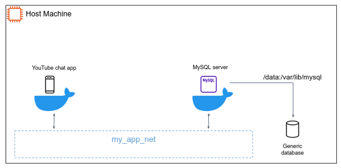
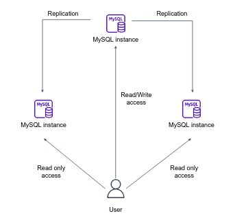
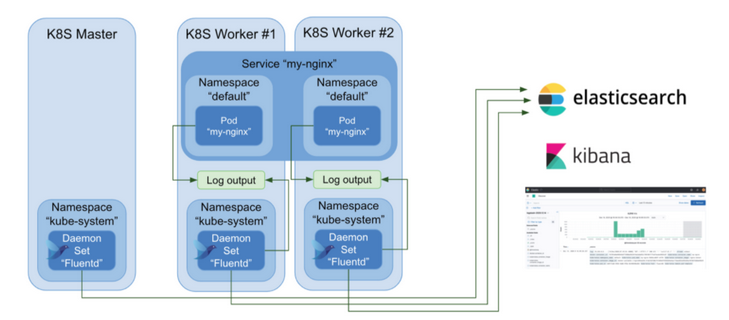

# Kubernetes Tutorials

## Install Minikube

https://minikube.sigs.k8s.io/docs/start/

## Install `kubectl`

1. Download the `kubectl` binary from [Kubernetes](https://kubernetes.io/docs/tasks/tools/install-kubectl-windows/#install-kubectl-binary-with-curl-on-windows) official site.


2. Put the `kubectl.exe` binary in a directory accessible in your PATH environment variable.

## Start K8S dashboard

Kubernetes Dashboard allows you to get easily acclimated to your new cluster.

1. Execute
```shell
minikube dashboard
```

2. To access the dashboard endpoint, open the following link with a web browser:
   http://127.0.0.1:36373/api/v1/namespaces/kubernetes-dashboard/services/http:kubernetes-dashboard:/proxy/


## Deploy the YouTube chat app as [**Pod**](https://kubernetes.io/docs/concepts/workloads/pods/)

Pods are the smallest deployable units of computing that you can create and manage in Kubernetes.
A Pod is a group of one or more **containers**, with shared storage and network resources, and a specification for how to run the containers.

1. In the k8s configuration file under `k8s/youtube-chat-app-pod.yaml` change `<docker-image-name>:<tag>` to a docker image name existed in your machine.
2. Load this image to Minikube by `minikube image load <docker-image-name>:<tag>` (this step is relevant for [Minikube users only](https://minikube.sigs.k8s.io/docs/handbook/pushing/#2-push-images-using-cache-command), in real cluster the image is being pulled from a private container registry).
3. Apply the configurations by: `kubectl apply -f k8s/youtube-chat-app-pod.yaml`

### Understanding Kubernetes Objects [:link:](https://kubernetes.io/docs/concepts/overview/working-with-objects/kubernetes-objects/)

Almost every Kubernetes object includes a nested object that govern the object's configuration: the object `spec`. 
The `spec` provides a description of the characteristics you want the resource to have: its **desired state**.

In the .yaml file for the Kubernetes object you want to create, you'll need to set values for the following fields:

- `apiVersion` - Which version of the Kubernetes API you're using to create this object.
- `kind` - What kind of object you want to create.
- `metadata` - Data that helps uniquely identify the object, including a name string, UID, and optional namespace.
- `spec` - What state you desire for the object.

**Labels** are key/value pairs that are attached to objects, such as Deployment.
Labels are intended to be used to specify identifying attributes of objects that are meaningful and relevant to users. E.g.:

- `"release" : "stable"`
- `"environment" : "dev"`
- `"tier" : "backend"`

Via a **Label Selector**, the client/user can identify a set of objects. 

## Deploy the YouTube chat app as [**Deployment**](https://kubernetes.io/docs/concepts/workloads/controllers/deployment/)

A Deployment provides declarative updates for **Pods** and **ReplicaSets**.
A ReplicaSet's purpose is to maintain a stable set of replica Pods running at any given time.

1. In the k8s configuration file under `k8s/youtube-chat-app-deployment.yaml` change `<docker-image-name>:<tag>` to a docker image name existed in your machine (build one if you need to).
2. Load this image to Minikube by `minikube image load <docker-image-name>:<tag>`.
3. Apply the configurations by: `kubectl apply -f k8s/youtube-chat-app-deployment.yaml`
4. Scale the app by changing `replicas: 1` to `replicas: 5`, apply your changes again. Make sure the ScaleSet increases your instances.
5. Perform a rolling update by deploying a new image version (e.g. from `0.0.1` to `0.0.2`) version.

## Pod lifecycle 

### Pod resources

> In order to complete the following demo, you need to install 
> a Metric server in the cluster.
> Metrics Server collects resource metrics (such as CPU and Memory usage) from Kubelets and exposes them in Kubernetes apiserver.
> If you are Minikube users, install it by the below command:
> ```text
> minikube addons enable metrics-server
> ```
> Or alternatively (for any other k8s cluster) by:
> ```shell
> kubectl apply -f https://github.com/kubernetes-sigs/metrics-server/releases/latest/download/components.yaml
> ```

In this exercise, you create a Pod that has one Container. The Container has a memory request of 50 MiB and a memory limit of 100 MiB. Here's the configuration file for the Pod:

1. Apply by `kubectl apply -f k8s/memory-stress-test.yaml`.
2. Use kubectl top to fetch the metrics for the pod:
```shell
kubectl top pod memory-demo
```

In the next exercise, you create a Pod that has one container. The container has a request of 0.5 CPU and a limit of 1 CPU. Here is the configuration file for the Pod:

1. Apply by `kubectl apply -f k8s/cpu-stress-test.yaml`.
2. Use kubectl top to fetch the metrics for the pod:
```shell
kubectl top pod cpu-demo
```

### Define liveness HTTP probes [:link:](https://kubernetes.io/docs/tasks/configure-pod-container/configure-liveness-readiness-startup-probes/)

1. Add the following liveness probe under to the `youtube-chat-app-deployment.yaml`, such that the `youtube-app` container spec will look like:
```yaml
containers:
   - name: youtube-app
     image: <docker-image-name>:<tag>
     livenessProbe:
      httpGet:
        path: /health
        port: 8080
      initialDelaySeconds: 3
      periodSeconds: 3
      failureThreshold: 3
```
2. Apply the changes.
3. (Optional) change the `/health` endpoint in `app/app.py` such that it will fail in 20-30 seconds after the app is up and running, watch k8s replacing unhealthy pods.
4. Add the following readiness probe under to the `youtube-chat-app-deployment.yaml`, such that the `youtube-app` container spec will look like:
```yaml
containers:
   - name: youtube-app
     image: <docker-image-name>:<tag>
     livenessProbe:
        httpGet:
           path: /health
           port: 8080
        initialDelaySeconds: 3
        periodSeconds: 3
        failureThreshold: 3
     readinessProbe:
        httpGet:
           path: /ready
           port: 8080
        initialDelaySeconds: 5
        periodSeconds: 5
```
5. Watch the behaviour of your app during rolling update.

## Pod horizontal autoscaler

A HorizontalPodAutoscaler (HPA) automatically updates a workload resource, with the aim of automatically scaling the workload to match demand.

1. First, let's stop and start the cluster with an extra configuration that will help us to monitor our pods in realtime:
```shell
minikube stop

# you may need to change the --driver to the driver the cluster is running on. 
minikube start --driver=docker  --extra-config=kubelet.housekeeping-interval=10s
```
2. To simulate a load on the app, we will use the `/load` endpoint defined in the `app.py` file (review it and make sure you understand what it does). 
3. Under `youtube-chat-app-deployment.yaml` add the following `resource` definition for the `youtube-app` container:
```yaml
- name: youtube-app
  image: public.ecr.aws/r7m7o9d4/myapp:0.0.5
  resources:
     limits:
        cpu: "200m"
     requests:
        cpu: "100m"
```
3. Build the image and deploy it in the cluster (update the `youtube-chat-app-deployment.yaml` according to the new image tag to apply the changes). 
4. Now that the server is running with the new endpoint, create the autoscaler:
```shell
kubectl apply -f k8s/youtube-chat-app-autoscaler.yaml
```
4. Next, see how the autoscaler reacts to increased load. To do this, you'll start a different Pod to act as a client. The container within the client Pod runs in an infinite loop, sending queries to the php-apache service.
```shell
# Run this in a separate terminal so that the load generation continues and you can carry on with the rest of the steps
kubectl run -i --tty load-generator --rm --image=busybox:1.28 --restart=Never -- /bin/sh -c "while sleep 0.01; do wget -q -O- http://youtube-app-service:8080/load; done"
```
5. Watch the HPA in action by `kubectl get hpa -w`.
6. (Optional) Perform a rolling update **during scale**.

[Read more](https://kubernetes.io/docs/tasks/run-application/horizontal-pod-autoscale-walkthrough/) to see how k8s can scale based on _packets per second_, _requests per second_ or even metrics not related to Kubernetes objects (such as messages in queue).

## Secret and ConfigMap

Recall the multi-app architecture we created using Docker compose:



We would like to deploy it in the k8s cluster. 

**Before we begin, clean your cluster from resources.** You can stop and delete the cluster by `minikube stop && minikube delete`, and then start over again a new fresh cluster. 

### The YouTube chat app

1. For simplicity, you are given the app version that designed to talk with an external MySQL db. The code can be found in `app-multi` in branch `main`, so no need to switch branches. 
2. Build the image according to the Dockerfile in `app-multi`. 
3. Deploy it using the `youtube-chat-app-multi.yaml` configuration file (does it work? why?).
4. We would like to create a cluster [Secret](https://kubernetes.io/docs/concepts/configuration/secret/) object to store the root user password for the MySQL database. Review the secret object in `k8s/mysql-secret.yaml` and apply it:
```shell
change '<docker-image-name>:<tag>' to 'public.ecr.aws/r7m7o9d4/myapp:0.0.5'
kubectl apply -f k8s/mysql-secret.yaml
```
5. Deploy the MySQL deployment by applying `mysql-deployment.yaml` configuration file.
6. Test your app (see **Visit the app** section below).

7. Now let's say we want to allow maximum of 50 connection to our DB. We would like to find a useful way to "inject" this config to our pre-built `mysql:5.7` image (we surely don't want to build the MySQL image ourselves). For that, the [ConfigMap](https://kubernetes.io/docs/concepts/configuration/configmap/) object can assist.
   In the `mysql` Docker image, custom configurations for the MySQL server can be placed in `/etc/mysql/mysql.conf.d` directory, any file ends with `.cnf` under that directory, will be applied as an additional configurations to MySQL. But how can we "insert" a custom file to the image? keep reading...
8. Review the ConfigMap object under `mysql-config.yaml`. And apply it.
9. Comment **in** the two snippets in `mysql-deployment.yaml` and apply the changes. 

## Visit the app 

How can we visit an app running in the cluster?

#### Using `kubectl`

You can use `kubectl port-forward` command to forward specific pod and port to your local machine, so you can visit the app under the `localhost:<port>` address.
This type of connection can be useful for pod debugging and obviously should not be used outside the borders of the development team.

Perform
```shell
kubectl port-forward svc/<service-name> <local-port>:<service-port> 
```
In our case:
   - `<service-name>` is `youtube-app-service`.
   - `<service-port>` is `8080`.
   - `<local-port>` can be `8083` (or any other free port on your local machine.

#### Using Service 

As you are already know, k8s [Service](https://kubernetes.io/docs/concepts/services-networking/service/) is an abstract way to expose an application running on a set of Pods as a network service.
Although each Pod has a unique IP address, those IPs are not exposed outside the cluster without a Service.  

Services can be exposed in different ways by specifying a `type` in the ServiceSpec. We will review two types:

- `ClusterIP` (default) - Exposes the Service on an internal IP in the cluster. This type makes the Service only reachable from within the cluster.
- `NodePort` - Exposes the Service on some port of each **Node** in the cluster. Makes a Service accessible from outside the cluster using <NodeIP>:<NodePort>.


1. Under `k8s/youtube-chat-app-multi.yaml` edit the `youtube-app-service` service object to use the `NodePort` service type:
```yaml
apiVersion: v1
kind: Service
metadata:
  name: youtube-app-service
spec:
  type: NodePort 
  selector:
    app: youtube-app
  ports:
    - port: 8080
      targetPort: 8080
      nodePort: 30007
```
2. Apply the change.
3. Use `minikube ip` to get the IP of Minikube "node" and visit the app in `http://<node-ip>:30007`

## Data persistence and the StatefulSet

The problem: the data of `mysql` deployment is not persistent.

### 1st try (Optional - go over it if you feel comfortable with k8s core concepts): [Persistent Volumes](https://kubernetes.io/docs/concepts/storage/persistent-volumes/)

A **PersistentVolume (PV)** is a piece of storage in the cluster that has been provisioned by an administrator or dynamically provisioned using [Storage Classes](https://kubernetes.io/docs/concepts/storage/storage-classes/).

In this section, we create a `hostPath` PersistentVolume, it simulates a separate, independent logical "volume" in the host machine. Kubernetes supports hostPath for development and testing on a single-node cluster. A hostPath PersistentVolume uses a file or directory **on the Node** to emulate attached storage.
In a production cluster, you would not use hostPath. Instead, a cluster administrator would provision a network resource like a Google Compute Engine persistent disk, an NFS share, or an Amazon Elastic Block Store volume.

1. Review and apply `k8s/mysql-pv.yaml`. 
   The configuration file specifies that the volume is at `/mnt/data` on the cluster's Node. The configuration also specifies a size of 3GB and an access mode of `ReadWriteOnce`, which means the volume can be mounted as read-write by a **single Node**.
2. View information about the PersistentVolume:
```shell
kubectl get pv mysql-pv-volume
```
The output shows that the PersistentVolume has a `STATUS` of `Available`. This means it has not yet been bound to a PersistentVolumeClaim.

Pods use **PersistentVolumeClaims** to request physical storage. We create a PersistentVolumeClaim that _requests_ a volume of at least 1GB that can provide read-write access for at least one Node.

3. Review and apply `k8s/mysql-pv-claim.yaml`.  
   After you've created the PersistentVolumeClaim, the Kubernetes control plane looks for a PersistentVolume that satisfies the claim's requirements. If the control plane finds a suitable PersistentVolume with the same StorageClass, it binds the claim to the volume.

4. In `k8s/mysql-deployment.yaml` enter the following mount and volumes in their appropriate location:
```yaml
volumeMounts:
   - name: config-volume
     mountPath: /etc/mysql/mysql.conf.d
   - name: mysql-data
     mountPath: /var/lib/mysql
```

and 

```yaml
volumes:
  - name: config-volume
    configMap:
      name: mysql-config
  - name: mysql-data
    persistentVolumeClaim:
      claimName: mysql-pv-claim
```
5. Apply the changes. 

While this solution works for a standalone DB stance, it won't work in case we want to run MySQL in multiple instances (and you want to...). Try to increase the `replicas` to `2` and investigate what happened.

### 2nd (and successful) try: [StatefulSet](https://kubernetes.io/docs/concepts/workloads/controllers/statefulset/)

Before we start, delete all the resources related to `mysql` from the previous try.

Review and apply `k8s/mysql-stateful.yaml`.

The address of MySQL will be: `mysql-0.mysql-svc-hl.default.svc.cluster.local:3306`

## Helm

Helm is the package manager for Kubernetes.
The main big 3 concepts of helm are:

- A **Chart** is a Helm package. It contains all the resource definitions necessary to run an application, tool, or service inside of a Kubernetes cluster.
- A **Repository** is the place where charts can be collected and shared.
- A **Release** is an instance of a chart running in a Kubernetes cluster.

[Install](https://helm.sh/docs/intro/install/) the Helm cli if you don't have.

### Deploy MySQL using Helm

Before we start, delete all the resources related to `mysql` from the previous try. 

How relational databases are deployed in real-life applications?

The following diagram shows a Multi-AZ DB cluster.



With a Multi-AZ DB cluster, MySQL replicates data from the writer DB instance to both of the reader DB instances.
When a change is made on the writer DB instance, it's sent to each reader DB instance.
Acknowledgment from at least one reader DB instance is required for a change to be committed.
Reader DB instances act as automatic failover targets and also serve read traffic to increase application read throughput.

Let's review the Helm chart written by Bitnami for MySQL provisioning in k8s cluster.

[https://github.com/bitnami/charts/tree/master/bitnami/mysql/#installing-the-chart](https://github.com/bitnami/charts/tree/master/bitnami/mysql/#installing-the-chart)

1. Add the bitnami Helm repo to your local machine:
```shell
# or update if you have it already: `helm repo update bitnami`
helm repo add bitnami https://charts.bitnami.com/bitnami
```

3. Review `k8s/mysql-helm-values.yaml`, change values or [add parameters](https://github.com/bitnami/charts/tree/master/bitnami/postgresql/#parameters) according to your need.
4. Install the `mysql` chart
```shell
helm upgrade --install -f k8s/mysql-helm-values.yaml mysql bitnami/mysql
```
5. To delete this release:
```shell
helm delete mysql
```

## Stream Pod logs to Elasticsearch logs databases using FluentD

### Fluentd introduced  

[Fluentd](https://www.fluentd.org/) is an open source data collector for unified logging layer.
Fluent allows you to unify data collection and consumption for a better use and understanding of data.

Here is an illustration of how Fluent works in the k8s cluster?



Fluentd runs in the cluster as a [DaemonSet](https://kubernetes.io/docs/concepts/workloads/controllers/daemonset/). A DaemonSet ensures that all **nodes** run a copy of a **pod**. That way, Fluentd can collect log information from every containerized applications easily in each k8s node.

We will deploy the Fluentd chart to collect containers logs to send them to [Elasticsearch](https://www.elastic.co/what-is/elasticsearch) database.

1. Visit the Fluentd Helm chart at https://github.com/fluent/helm-charts/tree/main/charts/fluentd
2. Add the helm repo
```shell
# or update if you have it already: `helm repo update fluent`
helm repo add fluent https://fluent.github.io/helm-charts
```

3. Install the Fluentd chart by:
```shell
helm install fluentd fluent/fluentd
```

4. Watch and inspect the running containers under **Workloads** -> **DaemonSet**. Obviously, it doesn't work, as Fluent need to talk to an existed Elasticsearch database.  
5. Elasticsearch db can be provisioned by applying `elasticsearch.yaml`.
6. Create a YAML file called `fluentd-helm-values.yaml`. You should override the [following](https://github.com/fluent/helm-charts/blob/main/charts/fluentd/values.yaml#L379) default Helm value by:
```yaml
fileConfigs:
  04_outputs.conf: |-
    <label @OUTPUT>
      <match **>
        @type elasticsearch
        host "<elasticsearch-host>"
        logstash_format true
        port <elasticsearch-port>
      </match>
    </label>
```
While replacing `<elasticsearch-host>` and `<elasticsearch-port>` with the hostname of Elasticsearch int the cluster.
7. Finally, upgrade the `fluentd` release by `helm upgrade -f k8s/fluentd-helm-values.yaml fluentd fluent/fluentd` 

### Fluentd permissions in the cluster

Have you wondered how does the Fluentd pods have access to other pods logs!? 

This is a great point to learn something about k8s role and access control mechanism ([RBAC](https://kubernetes.io/docs/reference/access-authn-authz/rbac/)). 

#### Role and ClusterRole

_Role_ or _ClusterRole_ contains rules that represent a set of permissions on the cluster (e.g. This Pod can do that action..). 
A Role always sets permissions within a particular _namespace_
ClusterRole, by contrast, is a non-namespaced resource.

#### Service account 

A _Service Account_ provides an identity for processes that run in a Pod.
When you create a pod, if you do not specify a service account, it is automatically assigned the `default` service account in the same namespace.

#### RoleBinding and ClusterRoleBinding

A role binding grants the permissions defined in a role to a user or set of users.
A RoleBinding may reference any Role in the same namespace. Alternatively, a RoleBinding can reference a ClusterRole and bind that ClusterRole to the namespace of the RoleBinding.

---

Observe the service account used by the fluentd Pods, observe their ClusterRole bound to them. 

## Visualize logs with Grafana

1. Review the objects in `grafana.yaml` and apply.
2. Visit grafana service and configure the Elasticsearch database to view all cluster logs (you may need to upgrade elasticsearch Docker image version).

## Split and deploy the Youtube chat app in microservices

TBD 

[comment]: <> (- Worker and web-server)

[comment]: <> (- RabbitMQ )

[comment]: <> (- Autoscale workers)